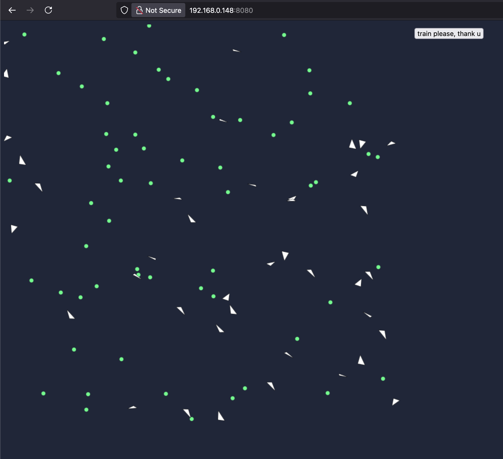

# Shorlark 
[](https://codecov.io/gh/niclaslind/shorelark)
[](https://deps.rs/repo/github/niclaslind/shorelark)

Learning to Fly: Simulating Evolution with Rust and WebAssembly

This project is inspired by the "Learning to Fly" series by Patryk Wychowaniec . It demonstrates how to simulate evolution using neural networks and genetic algorithms in Rust, compiled to WebAssembly. The simulation features virtual birds navigating a 2D world to find food, with each bird's behavior controlled by a neural network that evolves over time. Designed for Rust beginners, the series introduces key concepts and guides you through building an interactive ecosystem from scratch.

Explore the live simulation: https://shorelark.pwy.io 



## ✅ Prerequisites

Make sure you have the following installed:

- [Rust](https://www.rust-lang.org/tools/install)
- [wasm-pack](https://rustwasm.github.io/wasm-pack/installer/)
- [Node.js](https://nodejs.org/) (v14 or later)

Install `wasm-pack` if you haven't already:

```bash
cargo install wasm-pack
```

## 🛠️ Build & Run

### 1. Build the WASM package

Navigate to the Rust crate and compile it using `wasm-pack`:

```bash
cd libs/simulation-wasm
wasm-pack build 
```

### 2. Install frontend dependencies

Go to the www folder and install JavaScript dependencies:

```bash
cd www
npm install
```

### 3. Start the development server

#### Using npm

```bash
npm run start
```

#### Using npx

```bash
npx webpack serve
```

## 🔄 Rebuilding WASM After Changes

If you make changes to the Rust code, rebuild the WebAssembly package:

```bash
cd libs/simulation-wasm
wasm-pack build
```